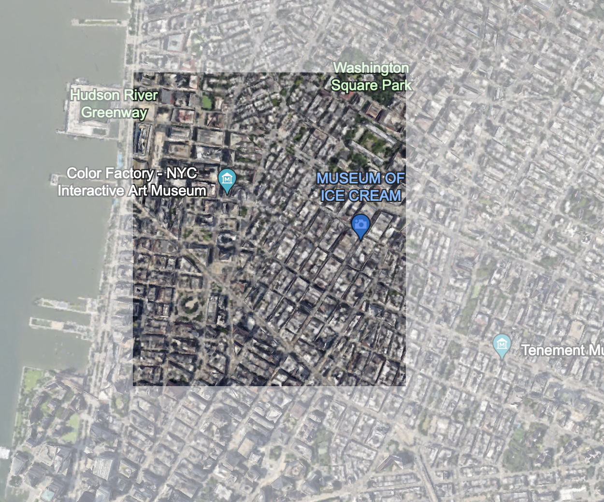
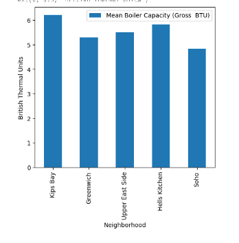
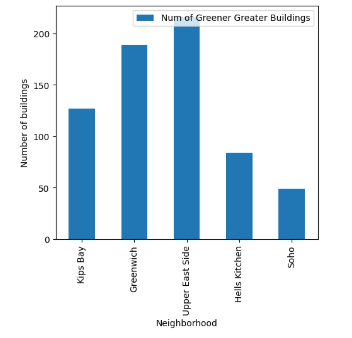
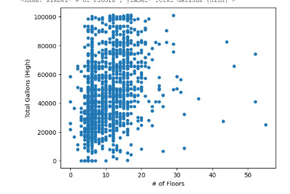
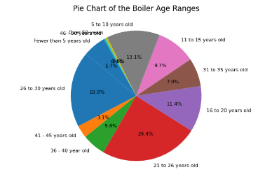

# Soho

## Highlighted map of HC6

## Basic demographics and statistics (HC2)
SoHo, short for "South of Houston Street" in Manhattan, New York City, is a trendy neighborhood known for its mix of art, culture, and historic architecture. The demographics include professionals, young adults, families, and tourists. The area, represented by zip codes 10012 and 10013, is a popular tourist destination for fashion and architecture enthusiasts.

The neighborhood has become home to some of the most expensive real estate in the country, with over 80% of housing units occupied, but only 28% owned by homeowners. The majority (72%) of residents rent, and almost 90% of the properties are valued over $1 million. As of July 2023, SoHo home prices increased by 27.8%, with a median price of $3.1M.

The population, around 52,000, has a slight majority of single residents. The middle 50% age range is 20-50, predominantly white. The average household income is $248,830, but the median income is $127,576. The population has an almost equal male-to-female ratio, with 85% having completed high school and nearly 97% employed. Approximately 70% have completed a bachelor's degree or higher.

Despite the affluent demographic, 10.23% of SoHo's population is below the poverty line, matching the official rate of 11.6%. About 70% of vacant units are not on the market. Only 20% of the population lived in SoHo before the 2000s, suggesting it's not a common choice for permanent residence. Nearly 50% of residents commute to work by public transit, with less than a 30-minute commute on average.

## HC3 Summary
Converting buildings to cleaner heating fuels is a complex challenge in addressing the heating sector's impact on climate change. Effective strategies include electrification, renewable natural gas, and policy implementation with fiscal incentives. According to the International Energy Agency (IEA), in their Faster Innovation Case, electrification, CCUS, and bioenergy contribute significantly to additional emission cuts by 2050.

The IEA emphasizes the efficiency of electric heat pumps, powered by natural resources. The Environmental Protection Agency (EPA) highlights renewable natural gases derived from various sources, including solid waste landfills and livestock farms. These gases can be used for thermal applications and electricity generation, providing cleaner heating options for building management.

Despite alternative options, policy implementation is crucial to encourage widespread adoption. The European Commission stresses the need for a collective effort by regional stakeholders and policymakers to transition to a climate-neutral economy. Fiscal incentives, such as tax credits, can play a role in motivating changes in upper management, contributing to the overall decarbonization of the environment. Ultimately, without significant cost savings or mandatory requirements, widespread adoption of cleaner heating fuels may be challenging.

## HC4 Summary
In New York City, greenhouse gas emissions predominantly arise from burning fossil fuels for electricity, amplified by the city's substantial power demand, particularly during peak times. Buildings emerge as the primary culprits, constituting about two-thirds of these emissions, with Manhattan, home to aging structures from the 1950s, being a major contributor. In response, the NYC City Council introduced Local Law 97 in 2019, targeting significant reductions in greenhouse gas emissions from large buildings, aiming for an 80% decrease by 2050. Large buildings, including residential, commercial, and institutional structures, consistently contribute to emissions, with Manhattan, boasting the highest population density. NYC is actively addressing this issue through legislative measures, as exemplified by a new law, effective from 2026, which prohibits the use of fossil fuels in most new buildings, showcasing the city's ongoing commitment to mitigating emissions and embracing cleaner energy solutions.
## HC7 and HC8 Summary
### Mean Total Gallons 
In HC7/HC8, we that out of all our neighborhoods in Manhattan, Hells Kitchen has the highest Mean Total Gallons, high or low. Here are the graphs:

.png)

.png)
### Mean Total MMBTU
Kips Bay has the highest Mean Total MMBTU (High) while Soho has the lowest. The Mean Total MMBTU ranges from about 4500 to 6500. Here is the graph:

.png)

Kips Bay also has the highest Mean Total MMBTU (Low) while Soho has the lowest. The Mean Total MMBTU ranges from about 6200 to 9000. Comparatively, Kips Bay boilers produce the most amount of heat. Here is the graph:

.png)
### Mean Boiler Capacity

This graph shows the boiler capacity in each of our neighborhoods. Kips Bay has the largest mean boiler capacity, which can be attributed to its larger population density. Here is the graph:

### Green Greater Buildings

Green Greater Buildings are buildings that can benefit the environment around them. The neighborhood with the most amount of these buildings is the Upper East Side whereas the neighborhood with the least amount of these buildings is Soho. Here is the graph:

We also discovered that there is no correlation between the number of floors and the total amount of gallons in each building. Looking at the scatterplot, there is no clear trend between the two axes. Here is the graph:

We also learned about the ages of boilers in each building. Most boilers are between 10 to 30 years old. About 10% of the boilers are 30+ years old and the rest are less than 10 years old. Here is the graph:

The above information is the product of the information we gathered in the past few weeks. We learned a lot, not only about our neighborhoods, but also how to convey that data effectively through the use of graphs and programming.

## Map of HC9
Here is my map from HC9:
<dl>
<iframe src="mapSoho.html" width="600" height="400" frameborder="0" frameborder="0" marginwidth="0" marginheight="0" allowfullscreen></iframe>
</dl>
